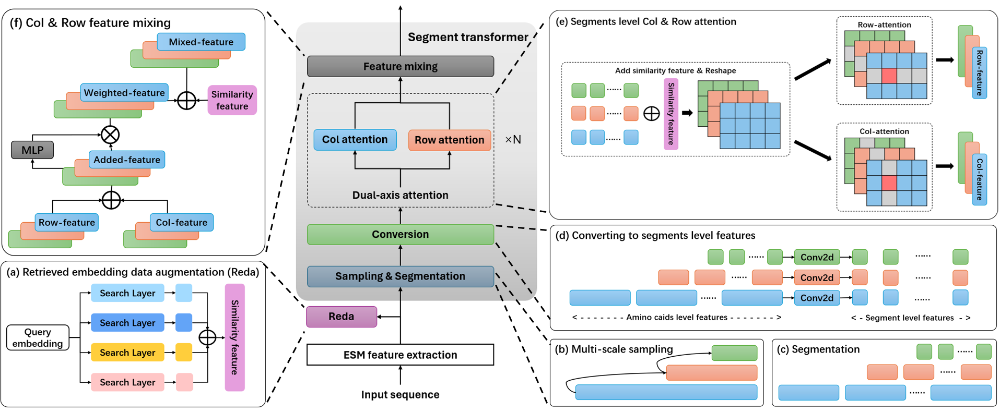

# RedaSegment

RedaSegment

RedaSegment is a deep learning model designed to predict enzyme thermal parameters, including optimal temperature, temperature range, and stability.

🔧 Setup
1. Download Model Weights
Download RedaSegment weights

Unzip the downloaded file and place the contents in the output/ folder.

2. Download ESM-2 Weights
Download ESM-2 weights manually.

Place the downloaded weights in the esm150/ folder.

🚀 Inference
To run inference on your own CSV file:

bash
复制
编辑
python inference.py \
  --config configs/stability_reda_segment.yaml \
  --weight output/split_clusters_stability_reda_segment/model.safetensors \
  --file path/to/your/csv/file
Replace path/to/your/csv/file with the actual path to your CSV input.

🏋️ Training
Step 1: Build Augmentation Databases
Run the following scripts to build the augmentation databases for different thermal properties:

bash
复制
编辑
python preprocess/build_aug_db_opt.py
python preprocess/build_aug_db_range.py
python preprocess/build_aug_db_stability.py
Step 2: Train the Model
Train the model for each task using the appropriate config file:

bash
复制
编辑
# Optimal temperature prediction
python train.py --config configs/opt_reda_segment.yaml

# Temperature range prediction
python train.py --config configs/range_reda_segment.yaml

# Thermal stability prediction
python train.py --config configs/stability_reda_segment.yaml
